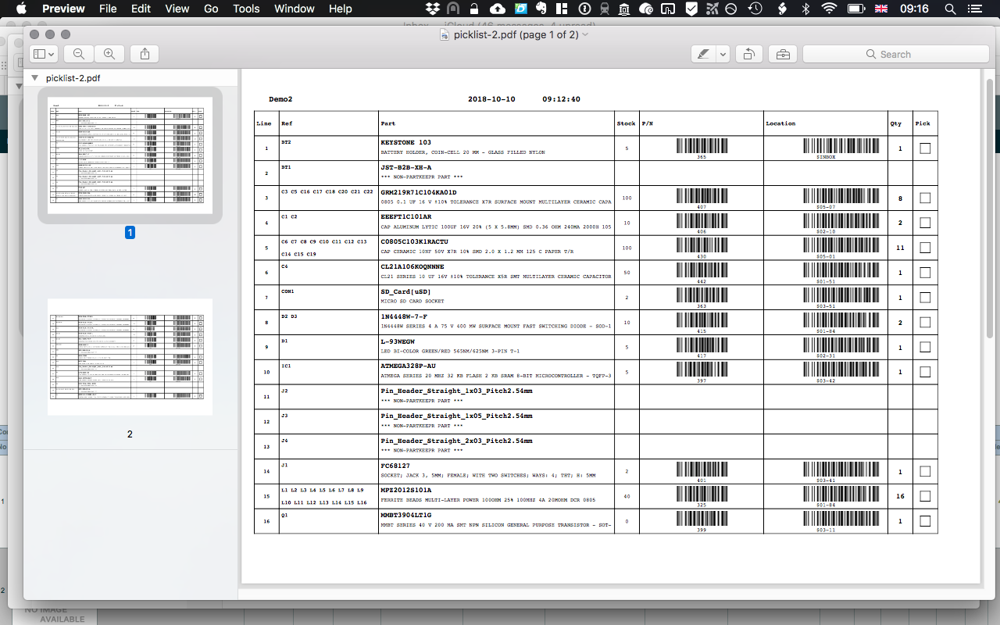

# KC2PK
KiCad to PartKeepr BOM Tool

This tool aims to integrate electronic component management using electronic designs produced in KiCad and inventory management using PartKeepr.

Kicad is an open-source Electronic Design Automation (EDA) tool (www.kicad-pcb.org) for producing printed circuit boards from electronic designs.

PartKeepr is an open source inventory management system (https://www.partkeepr.org) designed for stock control for electronic components.

This software is designed to bridge the process of determining which components are needed for a particular design. It identifies which parts are available and 'in stock', which parts are understocked for this build and which components are not stock items and will need to be ordered. Furthermore, it will look up line items in the BOM using an 'Octopart' query to determine live prices (and price breaks) and current stock leveles of a wide range of international suppliers. At present it runs from the command prompt and produces an output in html format. Additionally it produces quick order .csv files, a stock picklist output and barcoded labels to be added to bags after stock has been picked.

When a user finishes a design in KiCad, a Bill of Materials (BOM) is produced with a list of the components required to build the board. The purpose of this software is to query the PartKeepr database with all the components on the BOM and to produce a report of which products are in stock and which need to be ordered. If pricing data is in the PartKeepr database, a BOM cost can be calculated. Additionally, the script produces a 'pick list' to pull your components from stock and a set of labels (formatted to fit Avery compatible: L7164 / J8164 Stickers).

The settings for this script are now in a 'config.ini' file. Edit this to set the location, password and username for the PartKeepr server. Also enter your default currency, and a list of 'Preferred Dealers'. You should also enter an Octopart API key (freely available from http://www.Octopart.com). Setting the API Key will allow you access to the Octopart pricing data.

Whilst some of the components in the KiCad BOM may include specific manufacturers part numbers, in many cases, the electronic design includes generic 'jellybean' components. For example, a generic 0805 10K pull up resistor or any 0603 10nF decoupling capacitor will do. This script will identify such 'jellybeans' from the BOM and extract the parameters (eg resistance, case size, tolerance etc). When a part is added to PartKeepr, you can use Octopart to pull those values into the PK database.

The proposed workflow is as follows. A design is produced in Kicad and footprints are associated with each component either using cvpcb or by using 'Atomic' parts. (For many discussions about this, please see the KiCad forums). For manufacturer specific components, you specify the atomic components using a 'Part#'' field - e.g. ATMEGA328P_AU. For all GENERIC components you leave them exactly as they are - e.g. an 0805 resistor with the value set to 10K. You don’t need to set a part number but if you have a specific part in mind you can add the specific part number which will be chosen directly.

Once your EDA design is complete, you will need to export the BOM in a .csv format. I have been using KiBOM (https://github.com/SchrodingersGat/KiBoM) This allows some flexibility of output but a simple .csv output will serve as a suitable input into this script.

You then run my script on the BOM. It will check each line of the BOM against the PK database - looking up part references and retrieving stock levels and house part numbers/locations. My stock is bar coded so I generate the bar codes too. (You will need Zint >1.5 to get barcodes). The script produces a comprehensive report on the console. For jelly bean components the script reassembles the parameters from the footprint and value and looks it up in the database (like the example above). If I have a variety of component sources that meet the criteria then I get to select which component I am going to choose.

When the script ends, the user is presented with a web page with all the components on the original BOM. It identifies each BOM line with a colour key and gives info on stock level and location and, if printed, acts as a stock ‘Pick’list.

'Green' components are ones that are on the PK database and for which there is an adequate stock. 'Pink' components are on the PK database but the stock is insufficient for the project. (There are some items I have recently ordered which is why they have not yet been allocated inventory numbers and are in my INBOX). 'Bluey-green' lines are parts that I am not keeping a stock record of with PK e.g.	 various pin headers here.
The 'brownish' lines are ones where there is more than one component in the PK database that meets the parameters set and this was the one that was chosen at run time (see above). If you elect not to choose until you stock pick, there is an extra warning on the BOM sheet & the BOM total is not calculated as it is not meaningful.

I have added some icons for ROHS status and manufacturing status (with tooltips). The icons & stylesheets need to remain in the 'assets' directory. The output page is a webpage (webpage.html) in the same directory as the script.

By clicking on a part number, you can access a part information page that is built using the Octopart API. This will give you access to a list of product characteristics, datasheet links and a price breakdown for a wide range of distributors. Each line should ahve a SKU and is hotlinked to the component distributors.

There is a menu item for producting a pick list. If this is printed out it can be taken to the parts store and the components selected (the pick list has barcodes for all the componets and storage locations.)

 There is also a 'Labels' output; these labels can be put on bags / containers when the stock is picked and identify the project, the RefDes and have barcodes for partnumbers, location and quantity to easy stock management.

The final output is a csv/tsv file containing the refDes, the part number and quantity - this can be used as an source file to import as a Project in PartKeepr.

Any parts which are KNOWN not to be in the PK database are allocated a part number of ‘-’ which is registered on PK as a ’NonPartKeepr part - this makes it easy to import the BOM as you know already that the import will not fail!

Further outputs include a ‘MISSING’ list - these are items that do not exist on PK - so you could choose to add them and, secondly, an ‘UNDERSTOCK’ list which is a small CSV of the MPN and the shortfall in the number of components. (and a shortfall on the minimum stock level too. This can easily be copied and pasted into a supplier ‘Quick Order’ form.

Each component in the main webpage has a list of distributors (from a 'preferrred distributor list') and hotlinks to the appropriate SKU. If you set the appropriate 'SKU URL' in PartKeepr, this will take you straight to that distributors website. (Eg, Mouser is https://www.mouser.co.uk/Search/Refine.aspx?Keyword= ).

The script has been developed on macOS and runs on Python3. It should run on Unix type systems but might be more of a problem on Windows. There is a config.ini file which will need to be set up with appropriate entries for where the PK database is and a username and password. There are a number of Python dependencies - all of which should be installed easily with pip. The most important is mySQLconnector. (https://dev.mysql.com/doc/connector-python/en/connector-python-installation.html) If your PartKeepr database is not on mySQL you may need to adjust the configuration and the connector - I have no experience or knowledge of alternatives.

I have recently updated this tool with a number of enhancements. The main improvement is to set this out as a columnanr layout allowing one to sum prices for each provider. The cheapest price is automatically selected for each row but an alternative can be selected, which will then highlight the cell in orange. The whole row can be exluded form the BOM if you wish by ticking the 'exclude' box. The css output is rather less garish than before. I have added a few graphs which may be of value to some and add a bit of colour ;) 