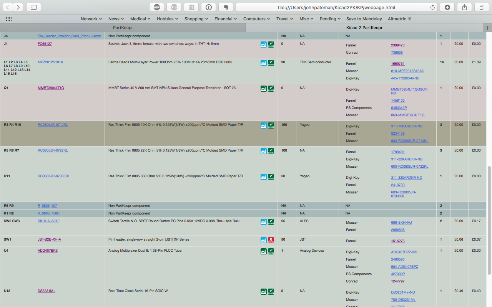
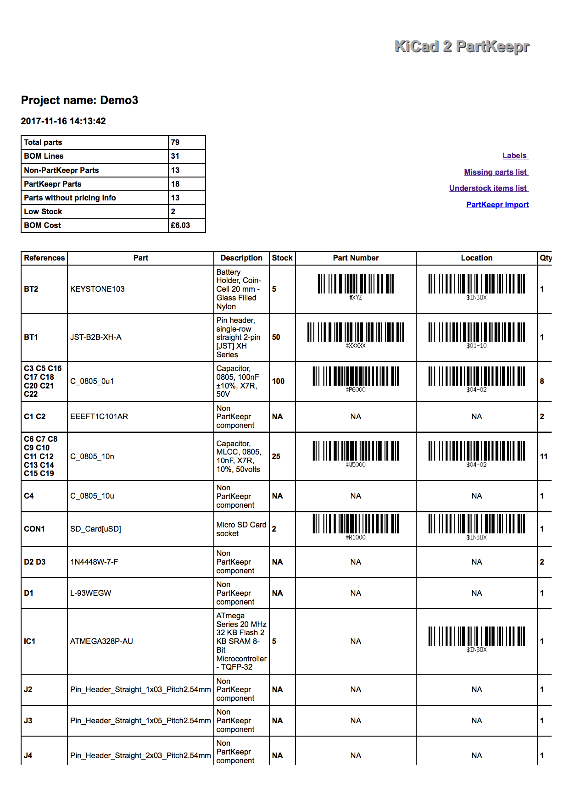
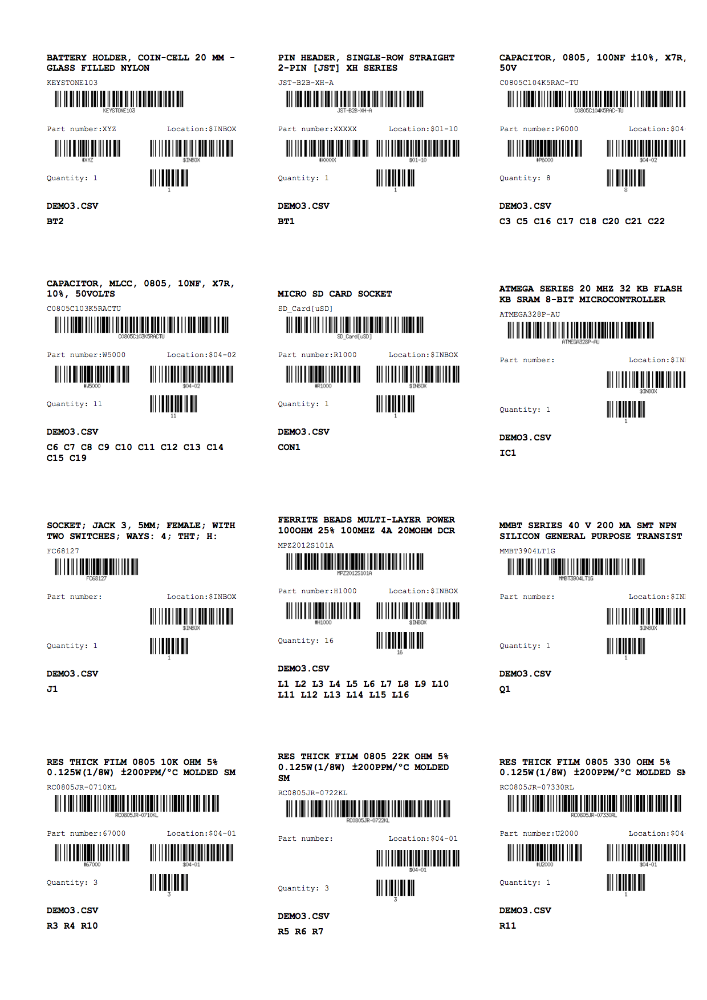

# KC2PK
KiCad to PartKeepr BOM Tool

This tool aims to integrate electronic component management using electronic designs produced in KiCad and inventory maagement using PartKeepr.

Kicad is an open-source Electronic Design Automation (EDA) tool (www.kicad-pcb.org) for producing printed circuit boards from electronic designs.

PartKeepr is an open source inventory management system (https://www.partkeepr.org) designed for stock control for electonic components.

When a user finishes a design in KiCad, a Bill of Materials (BOM) is produced with a list of the components required to build the board. The purpose of this software is to query the PartKeepr database with all the components on the BOM and to produce a report of which products are in stock and which need to be ordered. If pricing data is in the PartKeepr database, a BOM cost can be calculated. Additionally, the script produces a 'pick list' to pull your components from stock and a set of labels (formatted to fit Avery Compatible: L7164 / J8164 Stickers).

Whilst some of the components in the KiCad BOM may include specific manufacturers part numbers, in many cases, the electronic design includes generic 'jellybean' components. For example, a generic 0805 10K pull up resistor or a 10nF decoupling capacitor will do. This script will identify such 'jellybeans' from the BOM and extract the parameters (eg resistance, case size etc). When a part is added to PartKeepr, you can use Octopart to pull those values into the PK database.

The solution that I have come up with is as follows. You produce a design in Kicad and specify the atomic components that you want with a Part# field - e.g. ATMEGA328P_AU. For all GENERIC components you leave them exactly as they are - e.g. an 0805 resistor with the value set to 10K. You don’t need to set a part number but if you have a specific part in mind you can add the specific part number which will be chosen directly.

Once your EDA design is complete, you will need to export the BOM in a .csv format. I have been using KiBOM (https://github.com/SchrodingersGat/KiBoM) This allows some flexibility of output but a simple .csv output will serve as a suitable input into this script.

You then run my script on the BOM. It will check each line of the BOM against the PK database - looking up part references and retrieving stock levels and house part numbers/locations. My stock is bar coded so I generate the bar codes too. (You will need Zint >1.5 to get barcodes). For jelly bean components the script reassembles the parameters from the footprint and value and looks it up in the database (like the example above). If I have a variety of component sources that meet the criteria then I get to select which component I am going to choose.

When the script ends, the user is presented with a web page with all the components on the original BOM. It identifies each BOM line with a colour key and gives info on stock level and location and, if printed, acts as a stock ‘Pick’list.

Green components are ones that are on the PK database and there is adequate stock of. Pink components are on the PK database but the stock is insufficient for the project. (There are some items I have recently ordered which is why they have not yet been allocated inventory numbers and are in my INBOX). Bluey-green lines are parts that I am not keeping a stock record of with PK e.g.	 various pin headers here.
The brownish lines are ones where there is more than one component in the PK database that meets the parameters set and this was the one that was chosen at run time (see above). If you elect not to choose until you stock pick, there is an extra warning on the BOM sheet.

It prints out without the colours for stock picking. I haven’t added a lot of pricing to my stock but the option is there and I might go back and do it for the common components.

The script populates an output file which is a csv/tsv file containing the refDes, the part number and quantity - this can be used as an source file for a Project in PartKeepr. There is also a 'Labels' output; these labels can be put on bags / containers when the stock is picked and identify the project, the RefDes and have barcodes for partnumbers, location and quantity to easy stock management.

Any parts which are KNOWN not to be in the PK database are allocated a part number of ‘-’ which is registered on PK as a ’NonPartKeepr part - this makes it easy to import the BOM as you know already that the import will not fail!

Further outputs include a ‘MISSING’ list - these are items that do not exist on PK - so you could choose to add them and, secondly, an ‘UNDERSTOCK’ list which is a small CSV of the MPN and the shortfall in the number of components. (and a shortfall on the minimum stock level too. This can easily be copied and pasted into a supplier ‘Quick Order’ form.

The script has been developed on macOS and runs on Python3. It should run on Unix type systems but might be more of a problem on Windows. There is a config.ini file which will need to be set up with appropriate entries for where the PK database is and a username and password. There are a number of Python dependencies - all of which should be installed easily with pip. The most important is mySQLconnector. (https://dev.mysql.com/doc/connector-python/en/connector-python-installation.html) If your PartKeepr datbase is not on mySQL you may need to adjust the configuration and the connector - I have no experience or knowledge of alternatives.
